# Komdat & Jaringan Komputer Modul 1 : Wireshark dan GNS3
> Group B = http://10.4.89.247/ 

> Prefix ip = '10.85.x.x'
## Anggota

| NAMA | NRP |
| ------------- | -------------- | 
| I Ketut Weda Adikusuma | 5027251061 |
| D`qhaizhar Ari Dhiaulhaq | 5027251083 |


## Step 1
### Soal
Untuk mempersiapkan pembangunan The Wired, Lain yang berperan sebagai Router membuat tiga Switch/Gateway: Switch 1 menuju dua Entitas yaitu Alice dan Mika, Switch 2 menuju Chisa, sedangkan Switch 3 menuju Knights dan Eiri. Kelima Entitas tersebut dikonfigurasi sebagai Client di GNS3.

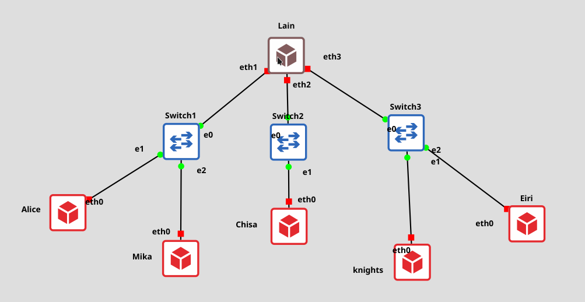 

### Konfigurasi
#### Lain
```
auto eth1
iface eth1 inet static
address 10.85.1.1
netmask 255.255.255.0

auto eth2
iface eth2 inet static
address 10.85.2.1
netmask 255.255.255.0

auto eth3
iface eth3 inet static
address 10.85.3.1
netmask 255.255.255.0
```
#### Alice 
```
auto eth0
iface eth0 inet static
address 10.85.1.2
netmask 255.255.255.0
gateway 10.85.1.1
```
#### Mika
```
auto eth0
iface eth0 inet static
address 10.85.1.3 
netmask 255.255.255.0
gateway 10.85.1.1
```
#### Chisa
```
auto eth0
iface eth0 inet static
address 10.85.2.2
netmask 255.255.255.0
gateway 10.85.2.1
```
#### Knights
```
auto eth0
iface eth0 inet static
address 10.85.3.2
netmask 255.255.255.0
gateway 10.85.3.1
```

#### Eiri 
```
auto eth0
iface eth0 inet static
address 10.85.3.3
netmask 255.255.255.0
gateway 10.85.3.1
```
## Step 2
### Soal
Karena menurut Lain pada saat itu The Wired masih terisolasi dari dunia luar, konfigurasikan router Lain agar dapat tersambung langsung ke jaringan internet publik melalui NAT/DHCP pada interface eth0.

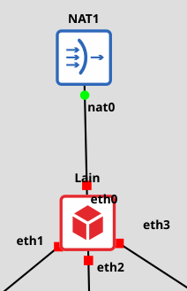 

Tambahkan konfigurasi pada router Lain
```
auto eth0
iface eth0 inet dhcp
```
## Step 3
### Soal
Setelah router Lain terhubung ke internet, pastikan seluruh Entitas (Client) di bawah Switch 1, Switch 2, dan Switch 3 dapat saling terhubung dan berkomunikasi satu sama lain melalui konfigurasi routing.
### Konfigurasi
Tambahkan IP Forwading pada router agar dapat saling berkomunikasi
```
up sysctl -w net.ipv4.ip_forward=1
```
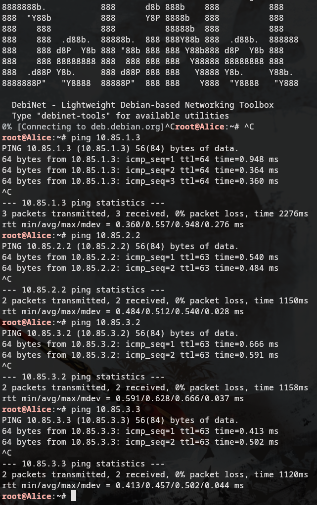 

## Step 4 
### Soal 
Lain ingin agar setiap Entitas (Client) memiliki kemandirian di The Wired. Konfigurasikan firewall/iptables (NAT Masquerade) dan DNS resolver agar setiap Client dapat terhubung ke internet secara mandiri (dapat melakukan ping ke 8.8.8.8 dan membuka domain web google.com).

### NAT Masquerading
Di konfigurasi router, tambahkan NAT Masquerade dan iptables untuk setiap eth port 
```
up iptables -t nat -A POSTROUTING -o eth0 -j MASQUERADE
iptables -A FORWARD -i eth1 -o eth0 -j ACCEPT
iptables -A FORWARD -i eth2 -o eth0 -j ACCEPT
iptables -A FORWARD -i eth3 -o eth0 -j ACCEPT
iptables -A FORWARD -i eth0 -m state --state ESTABLISHED,RELATED -j ACCEPT
```
### DNS Resolver
Put this DNS resolver `8.8.8.8` in every node, Kalau bisa taruh di `.bashrc` menggunakan command dibawah
```bash 
echo << "EOF" >> /root/.bashrc
echo "nameserver 8.8.8.8" > /etc/resolv.conf
echo "done bang"
EOF
```
## Step 5 
### Soal 
Eiri tetap berupaya menanamkan kekacauan ke dalam jaringan. Untuk mengantisipasi restart tiba-tiba, pastikan seluruh konfigurasi jaringan tidak hilang saat semua node di-restart. Buat script verifikasi di /root/cek_status.sh pada router Lain yang menampilkan ringkasan interface (ip -br a) dan status tabel NAT (iptables -t nat -L -v -n) setelah reboot.
### cek_status.sh 
```bash
#!/bin/bash
ip -br a
iptables -t nat -L -v -n
```
Untuk menampilkan script ini setelah reboot kita juga bisa menaruh script ini di .bashrc:
```bash
echo "bash cek_status.sh" >> .bashrc
```
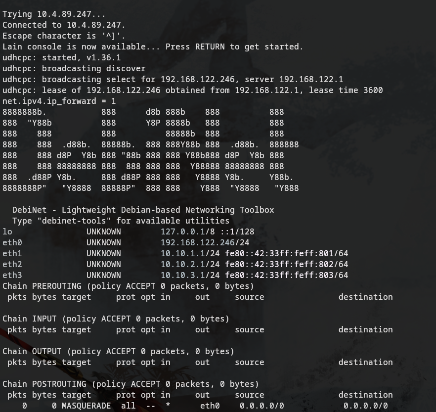 

## Step 6 
### Soal
Mika mencurigai adanya anomali traffic pada segmen jaringannya. Jalankan [Generator Traffic](https://drive.google.com/drive/folders/1ZjFvWIjvAQAjE9pPthm7V_bGyaSt93lY?usp=sharing)  pada node Mika, lalu lakukan packet sniffing menggunakan Wireshark pada interface node Mika. Terapkan display filter khusus untuk menyaring paket yang berprotokol DNS atau ICMP. Tunjukkan screenshot hasil filter beserta ringkasan paket yang lolos.

[traffic_protocol7](./scripts/traffic_protocol7.sh)

```bash
#!/bin/bash
# ============================================
# Traffic Generator — Protocol 7 Network
# Serial Experiments Lain — Modul 1 Jarkom 2026
# Jalankan di node MIKA untuk generate traffic DNS & ICMP
# ============================================

echo "============================================"
echo "  Protocol 7 Traffic Generator v2026"
echo "  Node: Mika Iwakura"
echo "============================================"
echo "[*] Generating DNS & ICMP traffic..."

# ICMP Traffic
ping -c 5 8.8.8.8 &
ping -c 5 1.1.1.1 &
ping -c 3 its.ac.id &

# DNS Queries
nslookup google.com 8.8.8.8 &
nslookup its.ac.id 8.8.8.8 &
nslookup github.com 1.1.1.1 &
dig @8.8.8.8 example.com A &
dig @1.1.1.1 cloudflare.com AAAA &

wait
echo "[*] Traffic generation complete."
echo "[*] Check Wireshark for captured packets."
```
### Packet Sniffing
#### Filter 
Gunakan filter DNS atau ICMP pada Wireshark:
```
dns or icmp
```
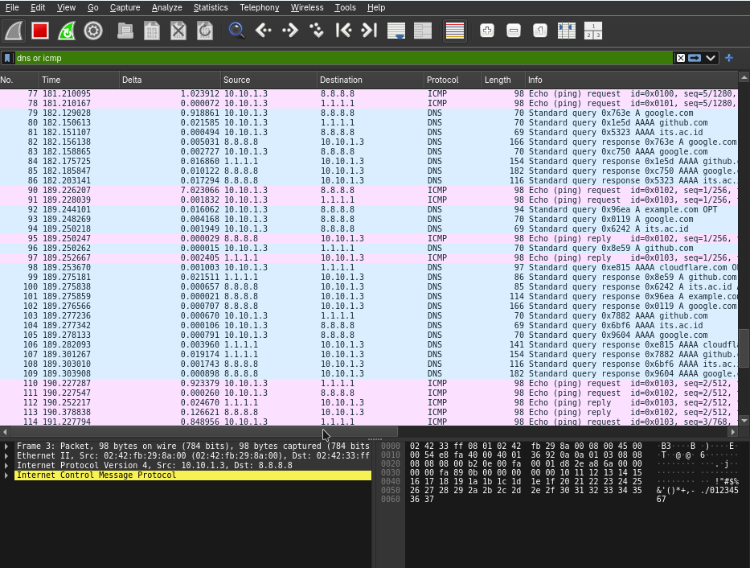 
#### Packet 
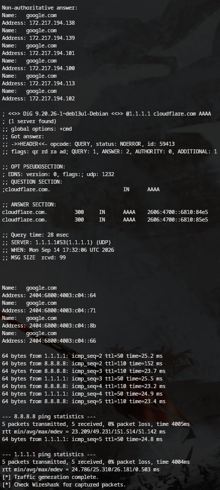 

## Step 7 
### Soal 
Chisa memutuskan mendirikan FTP Server pada node miliknya dengan shared folder di /var/wired/data. Terapkan kebijakan akses: user alice (hak akses read & write), user mika (dibatasi read-only), dan user eiri (dibatasi tanpa izin akses / blacklist). Buktikan konfigurasi dengan membuat file signal_alice.txt dari user alice, dan buktikan penolakan akses saat user eiri mencoba login.

### Setup Chisa
#### Menambahkan direktori /var/wired/data 
```bash 
mkdir -p /var/wired/data 
chmod 777 /var/wired/data 
```
#### Menambah Semua User
```bash
useradd -d /var/wired/data -s /usr/sbin/nologin alice
echo "alice:alice123" | chpasswd

useradd -d /var/wired/data -s /usr/sbin/nologin mika 
echo "mika:mika123" | chpasswd

useradd -d /var/wired/data -s /usr/sbin/nologin eiri
echo "eiri:eiri123" | chpasswd
```
#### Config vsftpd
```bash
listen=YES
listen_ipv6=NO
anonymous_enable=NO
local_enable=YES
write_enable=YES
dirmessage_enable=YES
use_localtime=YES
xferlog_enable=YES
connect_from_port_20=YES
chroot_local_user=YES
allow_writeable_chroot=YES
user_config_dir=/etc/vsftpd_user_conf
userlist_enable=YES
userlist_file=/etc/vsftpd.user_list
userlist_deny=YES
secure_chroot_dir=/var/run/vsftpd/empty
pam_service_name=vsftpd
rsa_cert_file=/etc/ssl/certs/ssl-cert-snakeoil.pem
rsa_private_key_file=/etc/ssl/private/ssl-cert-snakeoil.key
ssl_enable=NO
```
#### Add user priviliges
```bash
mkdir -p /etc/vsftpd_user_conf

cat << 'EOF' > /etc/vsftpd_user_conf/alice     
write_enable=YES
download_enable=YES
EOF

cat << 'EOF' > /etc/vsftpd_user_conf/mika     
write_enable=NO
download_enable=YES
EOF

echo "eiri" > /etc/vsftpd.user_list
```
#### Setting up vsftpd
```bash
chmod 555 /var/run/vsftpd/empty

grep -qxF '/usr/sbin/nologin' /etc/shells || echo '/usr/sbin/nologin' >> /etc/shells
```
Secara default, PAM (Pluggable Authentication Modules) memverifikasi bahwa shell yang ditetapkan pengguna terdaftar di /etc/shells sebelum mengizinkan layanan seperti FTP untuk mengautentikasi mereka (melalui pam_shells.so). Jika pengguna FTP memiliki shell mereka diatur ke /usr/sbin/nologin untuk memblokir akses SSH/terminal, otentikasi vsftpd gagal dengan kesalahan 530 Login salah kecuali /usr/sbin/nologin secara eksplisit tercantum dalam /etc/shells
### Privilige Testing 
#### Alice
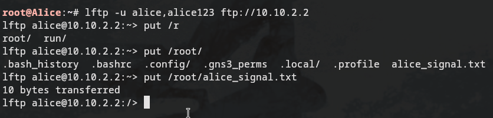
Alice dapat privilige read and write dimana user Alice bisa memodifikasi folder data dengan akses penuh.
#### Mika
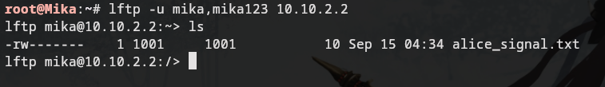 
Mika hanya bisa membaca folder tetapi tidak bisa melakukan modifikasi secara langsung.
#### Eiri
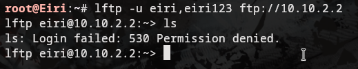
Eiri di ban sehingga tidak bisa mengakses folder data sama sekali.
## Step 8
### Soal
Kelompok rahasia Knights perlu mengirimkan dokumen laporan intelijen ke FTP Server Chisa. Lakukan koneksi FTP client dari node Knights ke FTP Server Chisa menggunakan akun alice. Upload file berikut [(link file)](https://drive.google.com/drive/folders/1tvZpueSH9E3GWwXM6KNnM64Y5wNoIAYP?usp=sharing). Analisis sesi Wireshark dan sebutkan: perintah FTP untuk upload (STOR), kode status sukses server (226), dan port data TCP yang dinegosiasikan pada mode PASV.
### Mengupload file dari Knights
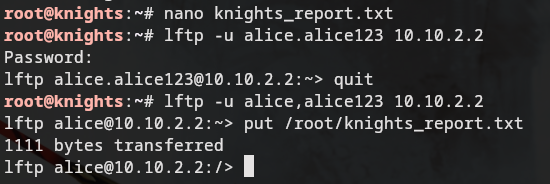
Dengan menggunakan user Alice, Knights dapat mengupload sebuah file karena memiliki akses write.
### Analisis Wireshark
Dengan mmenggunakan filter dibawah ini kita dapat membaca transmisi file knights_report.txt ke node Chisa
```plaintext
ftp.request.command contains "STOR" or ftp.response.code == 226 or ftp-data.command
```
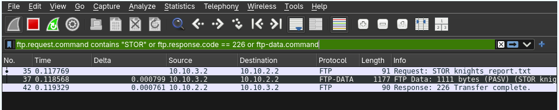

## Step 9
### Soal
Mika mengakses dokumen Protokol Tujuh di ([link file](https://drive.google.com/drive/folders/1S3hG0dnZBTkCta4uILWwKVc6dSYYGRJ6?usp=sharing)) dari FTP Server Chisa. Dari node Mika, unduh file tersebut menggunakan akun mika. Setelah itu, buktikan pembatasan read-only dengan mencoba mengunggah file baru dari akun mika, dan tunjukkan pesan error respon server (error 550 Permission denied) saat mika mencoba melakukan upload.

### Membuat File Protokol Tujuh di Chisa
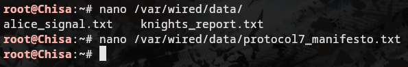 
### Testing Privilige Mika
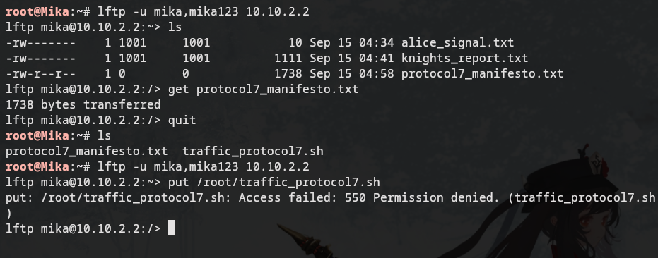 

## Step 10
### Soal
Knights melancarkan uji ketahanan koneksi ke server Chisa untuk menguji latensi jaringan The Wired. Kirimkan paket ping dari node Knights ke node Chisa dengan payload khusus 128 bytes dan interval 0.3 detik sebanyak 77 paket (ping -c 77 -s 128 -i 0.3 <IP_Chisa>). Buka Wireshark, catat nilai ICMP Type dan Code untuk Echo Request vs Echo Reply, serta analisis packet loss dan RTT (min/avg/max).

### Ping Chisa
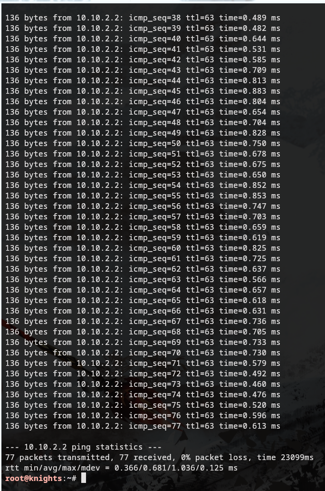

### Analisis Wireshark
#### ICMP Analysis
pake filter ```icmp.type contains "reply" and icmp.code``` dan ```icmp.type contains "request" and icmp.code``` 
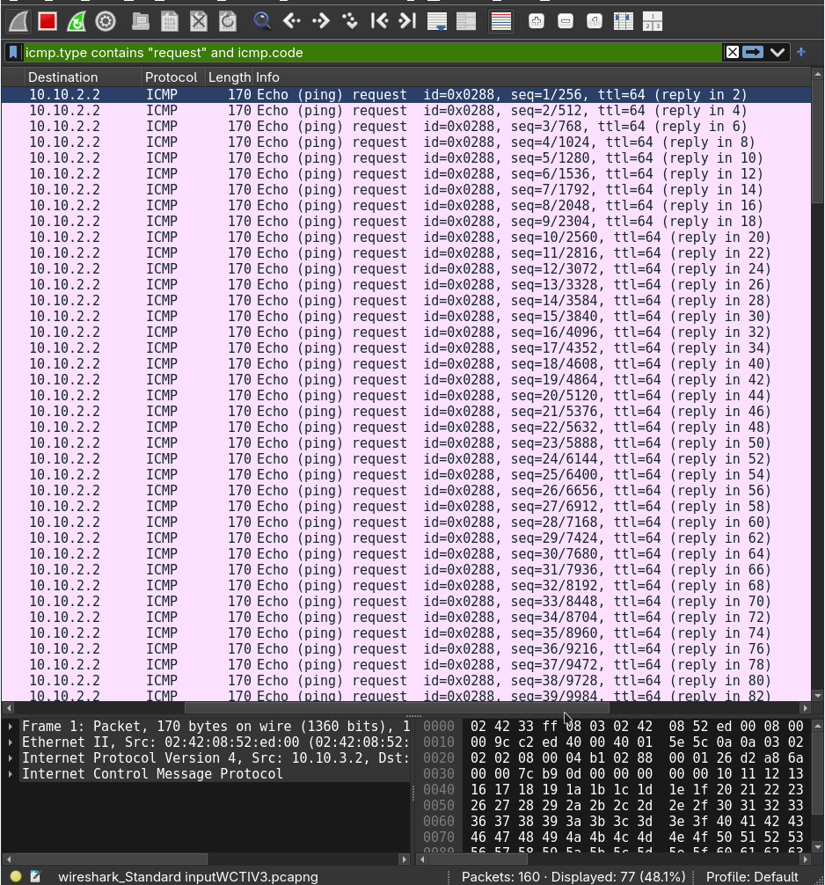
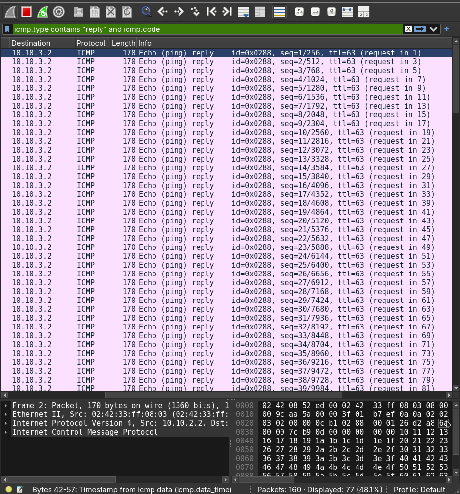 
#### Analisis Packet Loss & RTT 
setelah menjalankan 
```bash
ping -c 77 -s 128 -i 0.3 <IP_Chisa>
```
kita mendapatkan
```plaintext
--- 10.10.2.2 ping statistics ---
77 packets transmitted, 77 received, 0% packet loss, time 23099ms
rtt min/avg/max/mdev = 0.366/0.681/1.036/0.125 ms
```
statistics diatas menyatakan jalur layer 2 dan 3 berjalan optimal tanpa terjadi kongesti atau pembuangan paket (drop), serta rata rata deviasi sangat kecil menandakan latensi yang sangat stabil.

## Step 11
### Soal
Buktikan kelemahan protokol Telnet dengan membuat akun phantom_user dan password wired_ghost pada layanan telnetd di node Chisa. Lakukan login Telnet dari node Eiri ke node Chisa dan tangkap sesi menggunakan Wireshark. Tunjukkan kredensial plain text melalui fitur Follow TCP Stream, serta jelaskan mengapa setiap karakter terkirim dalam paket TCP terpisah.

### Setup Telnet di Node Chisa
```bash
apt update && apt install -y telnetd openbsd-inetd

echo "telnet stream tcp nowait root /usr/sbin/tcpd /usr/sbin/telnetd" >> /etc/inetd.conf
echo "inetd.conf done."

useradd -m -s /bin/bash phantom_user
echo "phantom_user:wired_ghost" | chpasswd
echo "user added."

/etc/init.d/openbsd-inetd start
echo "telnet service started."
```
Shell Script diatas digunakan untuk mensetup service telnet di Chisa serta menambahkan user `phantom_user` dengan password `wired_ghost`
#### Login Eiri
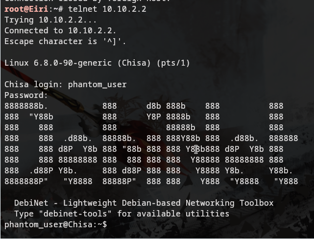
#### Analisis Telnet di Wireshark
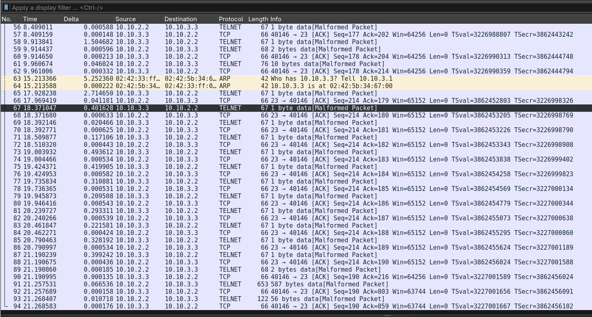
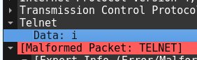 
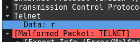 
 


## 14-20 & Flags
### Soal 14
```plaintext
KOMJAR26{FTP_Th3ft_O2caCcZMASnjObd7XvlwpIKOF}
```
